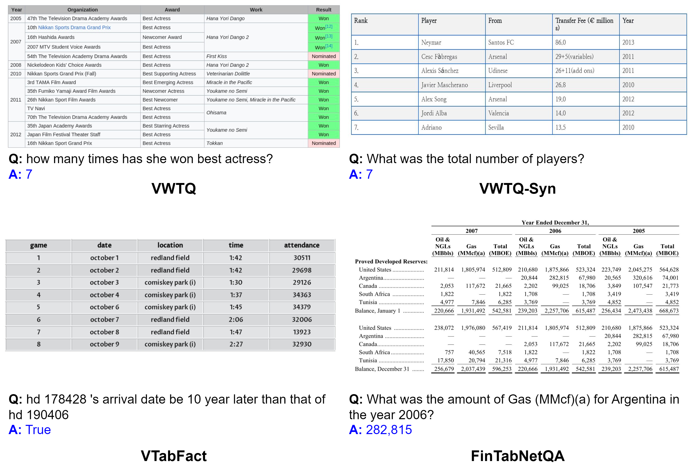
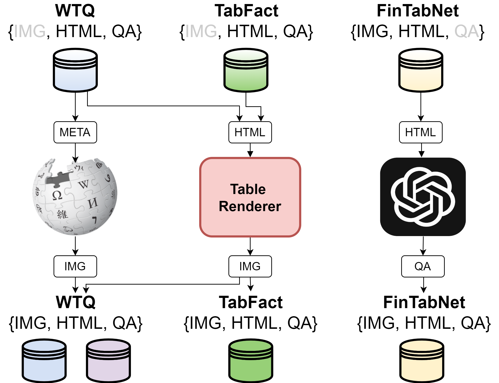

# TableVQA-Bench

 [**🤗 Dataset**](https://huggingface.co/datasets/terryoo/TableVQA-Bench) | [**📖 arXiv**](https://arxiv.org/abs/2404.19205) | [**GitHub**](https://github.com/naver-ai/tablevqabench)

## Introduction
In this paper, we establish a benchmark for table visual question answering, referred to as the TableVQA-Bench, derived from pre-existing table question-answering ([WTQ](https://ppasupat.github.io/WikiTableQuestions) , [TabFact](https://github.com/wenhuchen/Table-Fact-Checking)) and table structure recognition datasets ([FinTabNet](https://developer.ibm.com/exchanges/data/all/fintabnet/)). 
It is important to note that existing datasets have not incorporated images or QA pairs, which are two crucial components of TableVQA.
As such, the primary objective of this paper is to obtain these necessary components.
Specifically, images are sourced either through the **application of a stylesheet** or by employing the proposed **table rendering system**. 
QA pairs are generated by exploiting the large language model (LLM) where the input is a text-formatted table. 
Ultimately, the completed TableVQA-Bench comprises 1,500 QA pairs. 
We comprehensively compare the performance of various multi-modal large language models (MLLMs) on TableVQA-Bench.
Our findings suggest that processing visual inputs is more challenging than text inputs, as evidenced by the lower performance of MLLMs, despite generally requiring higher computational costs than LLMs. 
<p align="center">

</p>

## Data Creation
TableVQA-Bench encompasses VWTQ, VTabFact, and FinTabNetQA, which are extended from pre-existing databases such as WTQ, TabFact, and FinTabNet correspondingly. 
To acquire images for VWTQ and VTabFact, we source images by attaching the stylesheet of Wikipedia or by utilizing our table rendering system.
Conversely, FinTabNet is devoid of the QA pair, which is generated by employing the GPT-4. 
In the final stage of these processes, any samples with more than 50 table rows are methodically filtered out and the authors carry out a meticulous review.  

<p align="center">

</p>

## Quick Start
### Installation
```
pip install -r requirements.txt
```
### Inference

Example of model prediction: `inference_examples.ipynb`

Output of inference: `outputs/gpt4v`

### Evaluation
```
python ./src/evaluate.py --root_input_path [INFERENCE OUTPUT] --output_path [YOUR OUTPUT]
```
Example of evaluation: `evaluate_tablevqa.sh`

Output of evaluation: `outputs/gpt4v_evaluated`

## How to Cite
If you find this work useful to you, please cite:
```bibtex
@inproceedings{kim2024tablevqabench,
  title     = {TableVQA-Bench: A Visual Question Answering Benchmark on Multiple Table Domains},
  author    = {Kim, Yoonsik and Yim, Moonbin and Song, Ka Yeon},
  year      = {2024}
}
```

## License
```
TableVQA-Bench
Copyright (c) 2024-present NAVER Cloud Corp.

Permission is hereby granted, free of charge, to any person obtaining a copy
of this software and associated documentation files (the "Software"), to deal
in the Software without restriction, including without limitation the rights
to use, copy, modify, merge, publish, distribute, sublicense, and/or sell
copies of the Software, and to permit persons to whom the Software is
furnished to do so, subject to the following conditions:

The above copyright notice and this permission notice shall be included in all
copies or substantial portions of the Software.

THE SOFTWARE IS PROVIDED "AS IS", WITHOUT WARRANTY OF ANY KIND, EXPRESS OR
IMPLIED, INCLUDING BUT NOT LIMITED TO THE WARRANTIES OF MERCHANTABILITY,
FITNESS FOR A PARTICULAR PURPOSE AND NONINFRINGEMENT. IN NO EVENT SHALL THE
AUTHORS OR COPYRIGHT HOLDERS BE LIABLE FOR ANY CLAIM, DAMAGES OR OTHER
LIABILITY, WHETHER IN AN ACTION OF CONTRACT, TORT OR OTHERWISE, ARISING FROM,
OUT OF OR IN CONNECTION WITH THE SOFTWARE OR THE USE OR OTHER DEALINGS IN THE
SOFTWARE.

```
